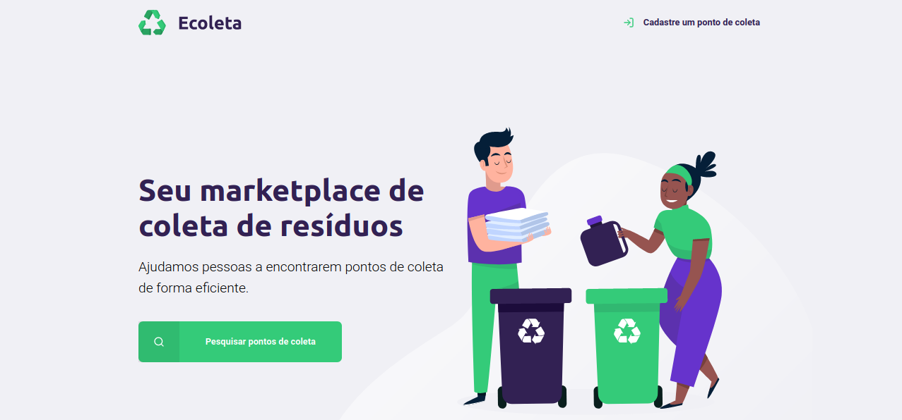

<h1 align="center">
    
</h1>

  <a href="#rocket-technologies">Technologies</a>&nbsp;&nbsp;&nbsp;|&nbsp;&nbsp;&nbsp;
  <a href="#-project">Project</a>&nbsp;&nbsp;&nbsp;|&nbsp;&nbsp;&nbsp;
  <a href="#-layout">Layout</a>&nbsp;&nbsp;&nbsp;|&nbsp;&nbsp;&nbsp;
  <a href="#-how to contribute">How to contribute</a>&nbsp;&nbsp;&nbsp;|&nbsp;&nbsp;&nbsp;
  <a href="#memo-license">License</a>

 

  

 

    

## 🚀 Technologies

This project was developed with the following technologies:

* [Node.js]
* [Express]
* [SQLite]
* [Nunjucks]
* [React]
* [ReactNative]
* [TypeScript]
* [jQuery] 

## 💻 Project

Ecoleta is an application project to connect collection points for recycling with people who have waste for disposal.

This project can help people who do not know what to do or are disposing of waste in an irregular way with institutions that can dispose of waste properly. Preserving the environment and community life can be made easier through this application.

## 🔖 Layout
You can view the project layout in the format through [this link](<https://www.figma.com/file/Byw4X5etg8VCmezueyhzkC/Ecoleta-(Starter)?node-id=136%3A546>). Remembering that you will need to have an account at [Figma]. 

## :contribute: 🤔 How to contribute

- Fork this repository;
- Create a branch with your feature: `git checkout -b my-feature`;
- Commit your changes: `git commit -m 'feat: My new feature'`;
- Push to your branch: `git push origin my-feature`.

After the merge of your pull request is done, you can delete your branch.

## :memo: License

This project is under the MIT license. See the file [LICENSE](LICENSE) for more details.

----

Made by [Wellington Cid](https://linkedin.com/in/wellingtoncid) with [Rocketseat](https://rocketseat.com.br) support.

   [ecoleta]: <https://github.com/wellingtoncid/Ecoleta>
   [React]: <https://reactjs.org/>
   [ReactNative]: <https://facebook.github.io/react-native/>
   [TypeSript]: <https://www.typescriptlang.org/>
   [Express]:<https://expressjs.com/>
   [Node.js]: <http://nodejs.org>
   [jQuery]: <http://jquery.com>
   [@wellingtoncid]: <http://twitter.com/wellingtoncid>
   [@wellingtoncid/in]: <http://linkedin.com/in/wellingtoncid>
   [SQLite]: <https://www.sqlite.org/index.html>
   [Nunjucks]: <https://mozilla.github.io/nunjucks/>
   [Figma]: <https://figma.com/>